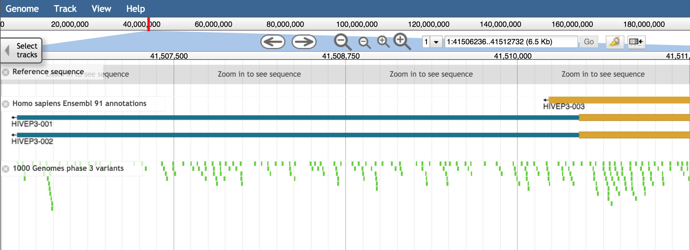

# RenameTracks

A simple JBrowse plugin that renames the key of a displayed track to a value from track metadata

### Configuration

In your `trackList.json`, add the following:
```json
"trackMetadata" : {
  "sources" : [
     {
        "url" : "data/trackMetadata.csv",
        "type" : "csv"
     }
  ],
  "alternateKey" : "column_name"
}
```

The `alternateKey` attribute tells the plugin which column to read from `trackMetadata.csv`.

### Example

If your `trackMetadata.csv` has a column named `short_name`:
```
key,label,short_name
"Reference Sequence",DNA,"GRCh38"
"Homo sapiens Ensembl 91 annotations",homo_sapiens_ensembl,"Ensembl 91"
"1000 Genomes phase 3 variants",1000GENOMES_phase_3_variants,"1000 Genomes (Phase 3)"
```

Then add the following to `trackList.json`:
```
"trackMetadata" : {
  "sources" : [
     {
        "url" : "data/trackMetadata.csv",
        "type" : "csv"
     }
  ],
  "alternateKey" : "short_name"
}
```

In this example, alternate key for each track is read from the `short_name` column.

### Screenshot

**Before**:



**After**:


